# Home automation with zigbee

In this project I would like to share my experience in how to control my home by mainly one digital cube and alternative with some wireless switches.

As well as using different zigbee sensors and actuators to monitor and control my home.

This project uses the ['Aqara Cube'](https://www.aqara.com/en/cube.html) as an interface to detect control requests. The Aqara cube can detect motions such as push, flip 90°, flip 180°, rotate and tap.

Furthermore the wireless switches are used to set the controlled devices in a previous defined state. This is used to imitate real live situation for example leaving the house and turn off all devices.

To receive the control messages from the cube this projects used the USB zigbee module ['CC2531'](https://www.ti.com/product/CC2531). Furthermore to interpret the signals I used ['zigbee2mqtt'](https://www.zigbee2mqtt.io) and ['Eclipse Mosquitto'](https://mosquitto.org) as a message broker.

# Overview of the project
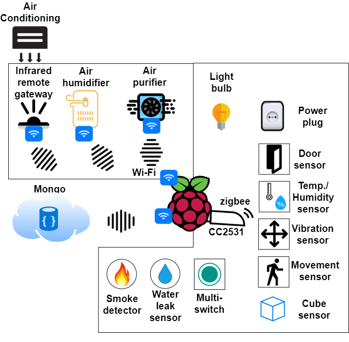


## Demo videos

[](https://youtu.be/E7pEbL2oeH4)

[](https://youtu.be/kR3BIJo7sAc)

## Smart cube


## Other used zigbee devices


## Zigbee component list
* ['Xiaomi Aqara smart LED bulb'](https://www.zigbee2mqtt.io/devices/ZNLDP12LM.html)
* ['Xiaomi MiJia wireless switch'](https://www.zigbee2mqtt.io/devices/WXKG01LM.html)
* ['Xiaomi Aqara wireless switch'](https://www.zigbee2mqtt.io/devices/WXKG11LM.html)
* ['Xiaomi Aqara wireless switch (with gyroscope)'](https://www.zigbee2mqtt.io/devices/WXKG12LM.html)
* ['Xiaomi Aqara temperature, humidity and pressure sensor'](https://www.zigbee2mqtt.io/devices/WSDCGQ11LM.html)
* ['Xiaomi MiJia human body movement sensor'](https://www.zigbee2mqtt.io/devices/RTCGQ01LM.html)
* ['Xiaomi Aqara human body movement and illuminance sensor'](https://www.zigbee2mqtt.io/devices/RTCGQ11LM.html)
* ['Xiaomi MiJia door & window contact sensor (contact)'](https://www.zigbee2mqtt.io/devices/MCCGQ01LM.html)
* ['Xiaomi Aqara door & window contact sensor (contact)'](https://www.zigbee2mqtt.io/devices/MCCGQ11LM.html)
* ['Xiaomi Aqara water leak sensor (water leak true/false)'](https://www.zigbee2mqtt.io/devices/SJCGQ11LM.html)
* ['Xiaomi Mi/Aqara smart home cube'](https://www.zigbee2mqtt.io/devices/MFKZQ01LM.html)
* ['Xiaomi Mi power plug ZigBee TW'](https://www.zigbee2mqtt.io/devices/ZNCZ03LM.html)
* ['Xiaomi MiJia Honeywell smoke detector'](https://www.zigbee2mqtt.io/devices/JTYJ-GD-01LM_BW.html)
* ['Xiaomi Aqara vibration sensor'](https://www.zigbee2mqtt.io/devices/DJT11LM.html)
* ['Gledopto Smart 4W E14 RGB '](https://www.zigbee2mqtt.io/devices/GL-B-001Z.html)

## Example of Zigbee messages

##### Aqara Cube 
```
{"battery":100,"voltage":3065,"linkquality":63,"angle":170,
"angle_x":2,"angle_y":-2,"angle_z":87,"angle_x_absolute":88,
"angle_y_absolute":92,"strength":36}

# Flip
{"battery":91,"voltage":2985,"linkquality":65,"side":2,"angle":90.8,
"action":"flip90","from_side":0,"to_side":2}

# Slide
{"battery":91,"voltage":2985,"linkquality":60,"side":2,"angle":90.8,
"action":"slide"}

# Tab
{"battery":91,"voltage":2985,"linkquality":84,"side":2,"angle":90.8,
"action":"tap"}

# Shake
{"battery":91,"voltage":2985,"linkquality":0,"side":2,"angle":90.8,
"action":"shake"}

```
##### Xiaomi door sensor
```
{"battery":100,"voltage":3055,"linkquality":89,"contact":true}


```
##### Aqara door & window contact sensor
```
{"battery":100,"voltage":3055,"contact":false,"linkquality":18}
```
##### MiJia human body movement sensor
```
{"battery":100,"voltage":3055,"linkquality":44,"occupancy":true}
```
##### Aqara vibration sensor
```
{"battery":100,"voltage":3065,"linkquality":70,"angle":107,
"angle_x":2,"angle_y":-2,"angle_z":87,"angle_x_absolute":88,
"angle_y_absolute":92}

{"battery":100,"voltage":3065,"linkquality":70,"angle":171,
"angle_x":2,"angle_y":-2,"angle_z":87,"angle_x_absolute":88,
"angle_y_absolute":92,"action":"tilt"}
```

##### Mi power plug ZigBee - ZNCZ02LM
```
{"state":"ON","power":2.3,"voltage":null,"consumption":0.11,
"temperature":25,"linkquality":60}

# Turn power plug ON/OFF (Testing)
mosquitto_pub -d -t zigbee2mqtt/0x00158d0003c770b9/set -m 
'{"state": "ON"}'
```

##### Aqara smart LED bulb - ZNLDP12LM
```
{"state":"ON","brightness":255,"color_temp":100,"linkquality":36}

# Turn light blub ON/OFF (Testing)
mosquitto_pub -d -t zigbee2mqtt/0x00158d0003c770b9/set -m 
'{"state": "ON"}'

# Set light color temperature (Testing)
mosquitto_pub -d -t zigbee2mqtt/0x00158d0004313469/set -m 
'{"color_temp": "400"}' 

# Set brightness (Testing)
mosquitto_pub -d -t zigbee2mqtt/0x00158d0004313469/set -m 
'{"brightness": "254"}'

```


##### Aqara water leak sensor
```
{"battery":100,"voltage":3055,"linkquality":97,"water_leak":true}
```


##### Gledopto Smart 4W E14 RGB / CCT LED bulb
```
{"state":"ON","brightness":254,"linkquality":70,"color":
{"x":0.526676280311873,"y":0.41329727450763},"color_temp":500}
```

Other ['supported zigbee'](https://www.zigbee2mqtt.io/information/supported_devices.html) devices

# Zigbee pipeline
The schema below shows how the communication between the sensor and the implemented logic is setup.

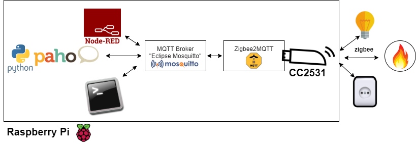

## CC2531

The USB dongle CC2531 is used to send and receive Zigbee messages.

['Flashing'](https://www.zigbee2mqtt.io/getting_started/flashing_the_cc2531.html) the CC2531 USB stick.

## zigbee2mqtt
This projects uses ['zigbee2mqtt'](https://www.zigbee2mqtt.io) to send and receive zigbee messages via mqtt.

```
nano /opt/zigbee2mqtt/data/configuration.yaml

sudo systemctl restart zigbee2mqtt
systemctl status zigbee2mqtt.service

```

## Eclipse Mosquitto

#### Install Mosquitto
This project uses as a message broker Eclipse Mosquitto. ['Mosquitto Debian repository'](https://mosquitto.org/blog/2013/01/mosquitto-debian-repository/) hosts the version for the raspberry pi.

```
sudo apt update
sudo apt install -y mosquitto mosquitto-clients
pip install paho-mqtt

nano /opt/zigbee2mqtt/data/configuration.yaml

sudo systemctl restart zigbee2mqtt
systemctl status zigbee2mqtt.service

#Prints all zigbee messages
mosquitto_sub -t \#

#Example of sending a zigbee message via the terminal
mosquitto_pub -d -t zigbee2mqtt/0xXXXXXXXXXXXXXXX/set -m 
'{"state": "ON"}'

```

## Automation web dashboard based on node-red
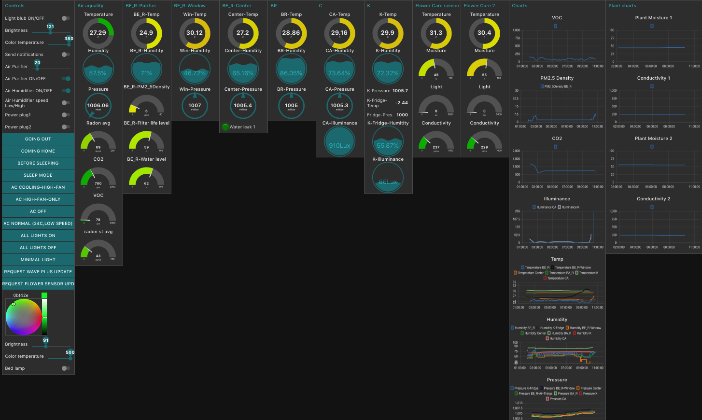


## Node-red
Node-red is used to implement the logic of the home automation via action boxed on a web interface.

* Node-red config interface: http://IP:1880
* Node-red dashboard: http://192.168.0.145:1880/ui/#!/0
* Node-red ['security settings'](https://nodered.org/docs/user-guide/runtime/securing-node-red)

Change security setting in configuration file below
```
sudo nano /home/pi/.node-red/settings.js
```

## Implementation of functionalities in node-red

### Temperature, Humidity and air pressure
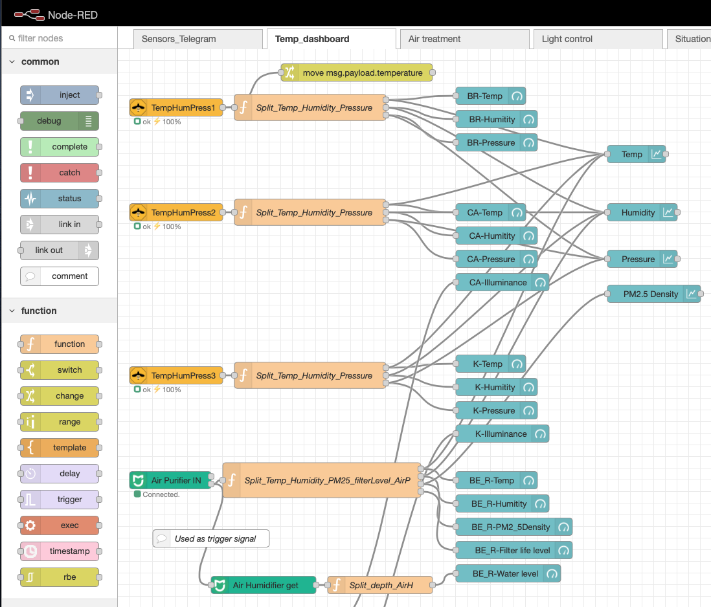

### Telegram
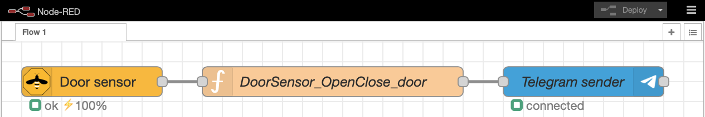

### IR-Gateway to control the Air condition
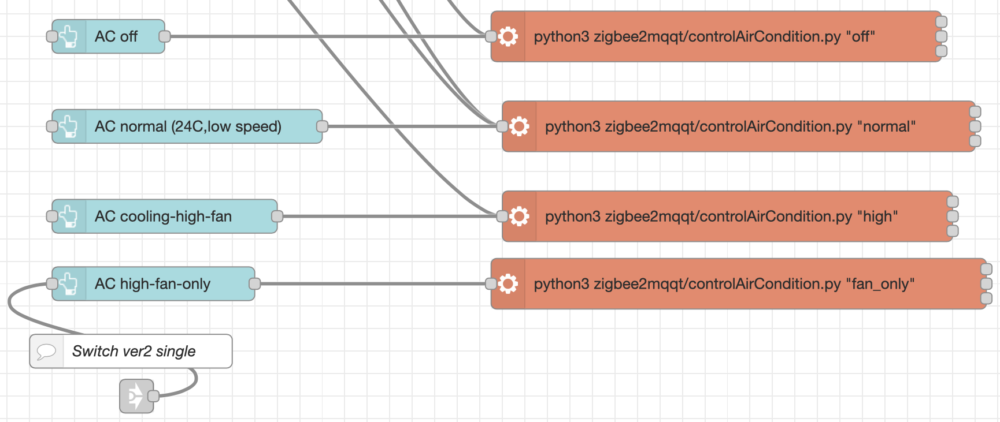

### Air purifier and air humidifier control
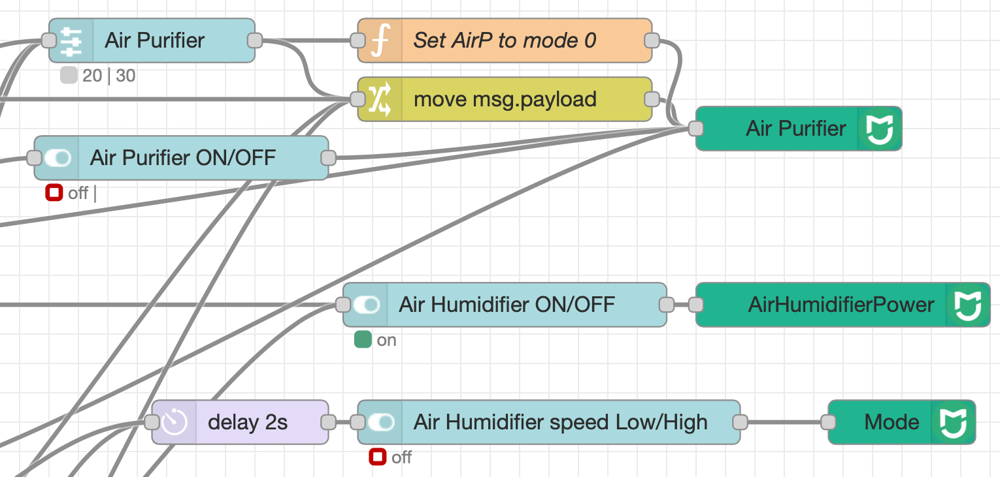

### Gledopto lamp control
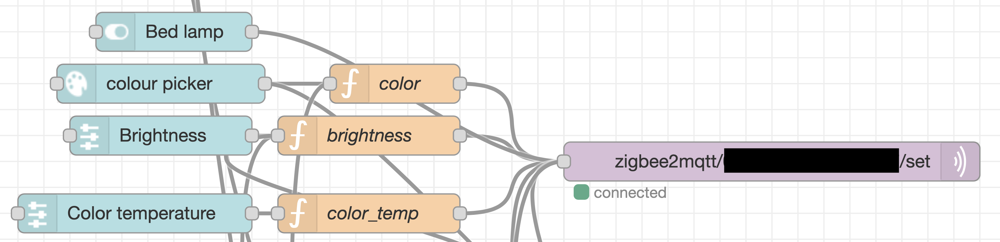

### Aqara lamp control
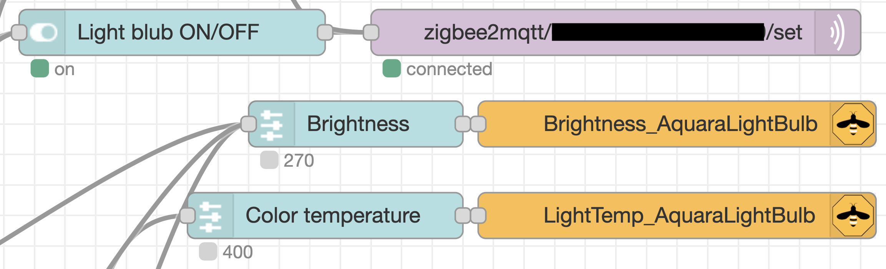

### Power plug
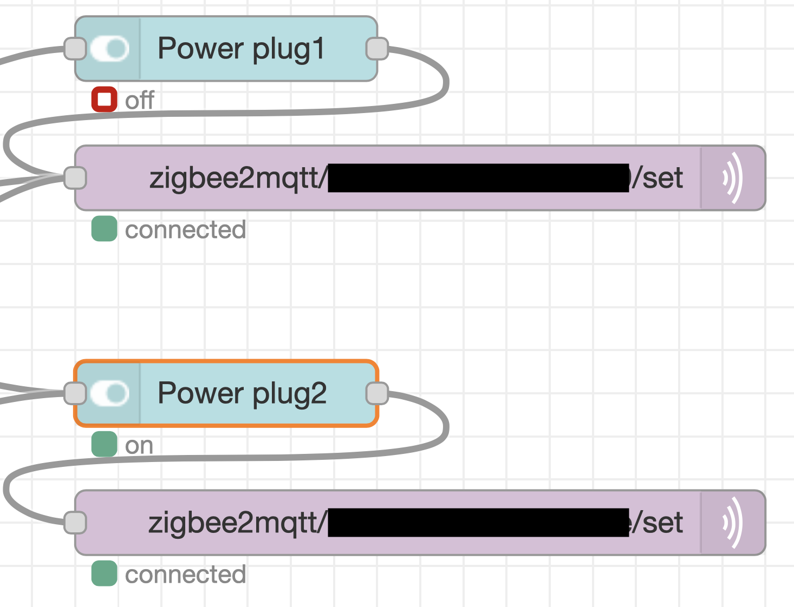

### "Flower care" house plant sensor
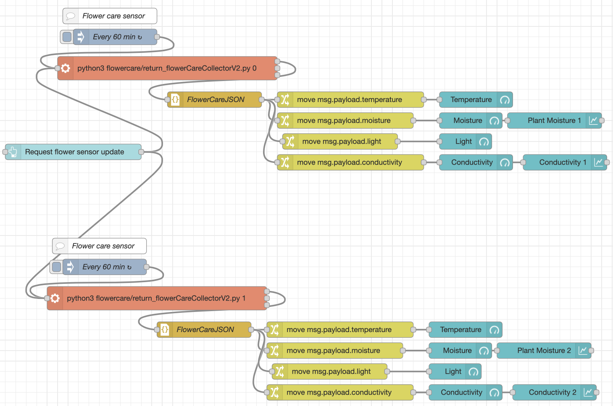

### Airthings Wave Plus sensor
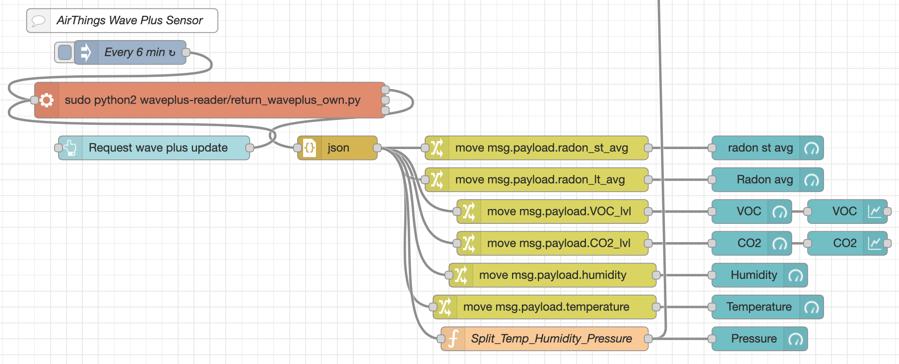

### Water leak sensor
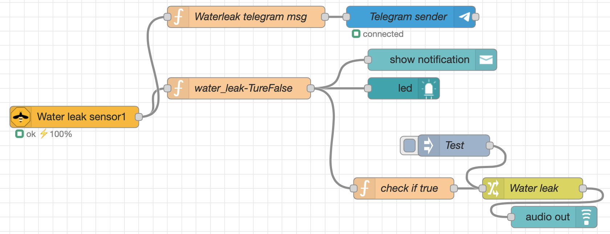

### Xiao-mi switch for situation control
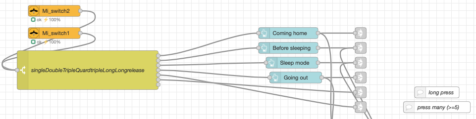
Each switch press action (single, double, triple, quadruple, long press and hold) is connected to a different set of instructions to set all devices in a previous defined state, depending on the situation.

### Aqara switch for situation control
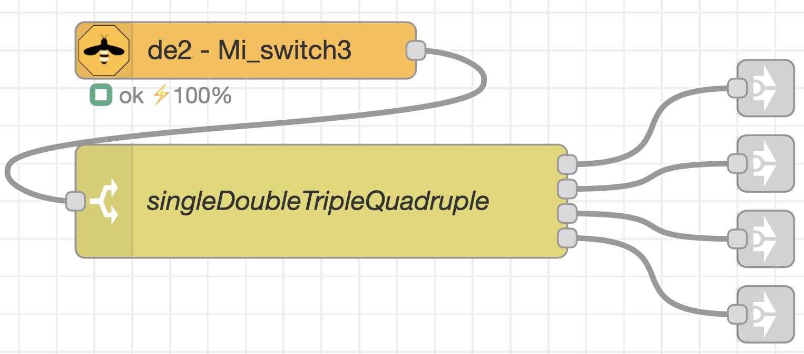


